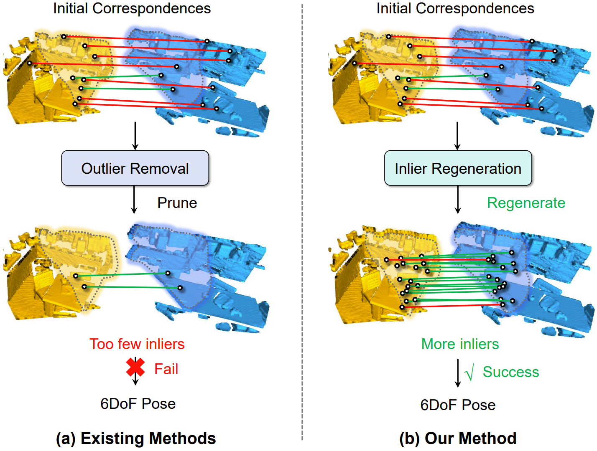
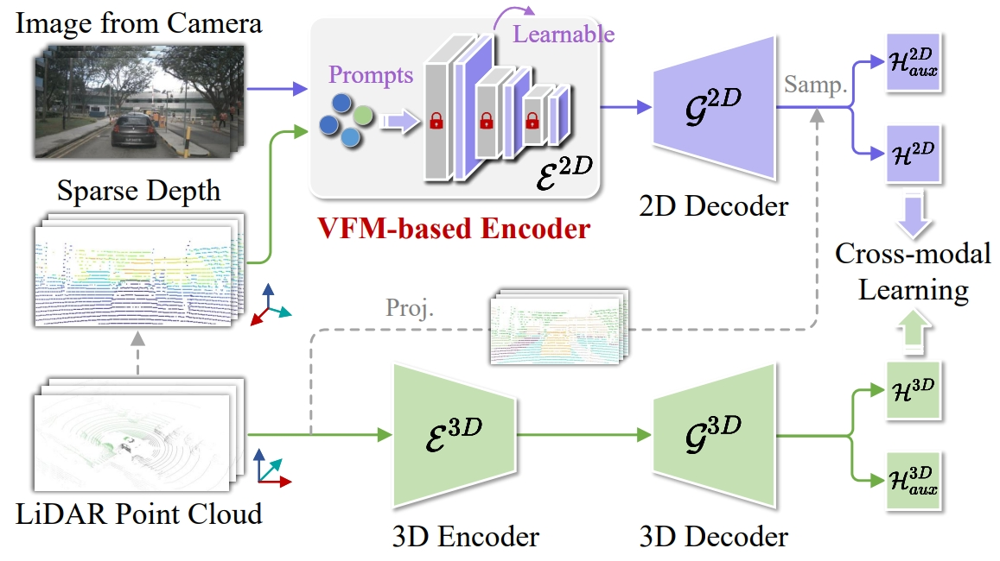
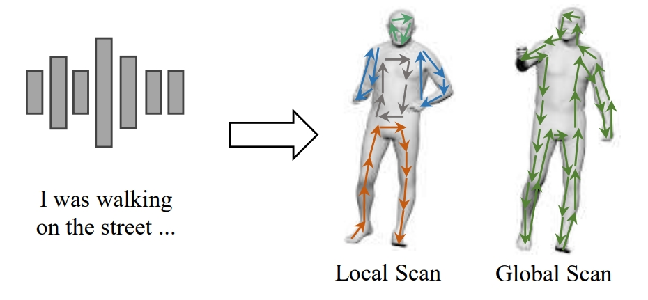
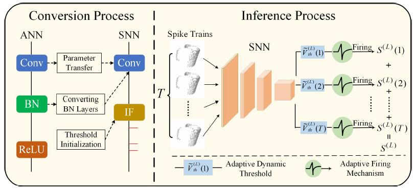
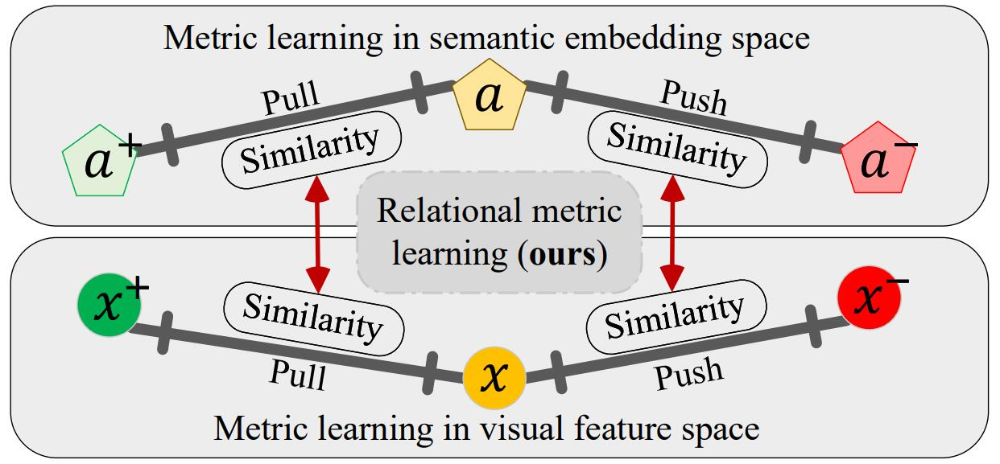

I am an Assistant Professor working with Prof. [Cheng Wang](https://scholar.google.com.hk/citations?user=kAnv3SkAAAAJ&hl=zh-CN&oi=ao) at School of Informatics, Xiamen University in Xiamen, Fujian, China. I received the Ph.D. degree from Sun Yat-Sen University (SYSU) in 2024, supervised by Prof. [Yulan Guo](https://scholar.google.com.hk/citations?user=WQRNvdsAAAAJ&hl=zh-CN&oi=ao). My research interests focus on 3D deep learning, particularly on 3D feature learning, registration and localization.

🤡**I am actively recruiting self-motivated master students.** 🤝

<li> I plan to admit 2 master students in 2026. I am not concerned about the level of your undergraduate institution; I require a down-to-earth attitude, the drive to improve, a strong sense of self-motivation, and compliance with the laboratory’s unified management.

<li> For master students who aspire to work in the industry, I will focus on cultivating their practical skills. 

<li> For master students who wish to further their academic studies, I will train them to the standard of PhD students, equipping them with the ability to conduct independent research.  

<li> I am also recruiting several high-year undergraduate interns. The recruitment is aimed at students majoring in computer science, automation, mathematics, and related fields.
_______________________________________________________________________________________________________

<html lang="en">
<head>
<meta charset="UTF-8">
<meta name="viewport" content="width=device-width, initial-scale=1.0">
<title>News滚动展示</title>

</head>
<body>
<h3>
   ✍News
</h3>

  

    <ul>
  <li> <strong>[Feb 2025]</strong> Three paper are accepted by CVPR 2025!</li>
  <li> <strong>[Jun 2025]</strong> One paper is accepted by ICRA!</li>
    </ul>
  

</body>
</html>

_______________________________________________________________________________________________________

<h3>
   📚Selected Publications (1️⃣ Equal contribution, 📧 Corresponding author)
</h3>

        <table cellspacing="0" cellpadding="0" class="noBorder">
           <tbody>
               <tr>
                    <td width="40%">
                        
                            </td>
                    <td>
                            <b>Progressive Correspondence Regenerator for Robust 3D Registration</b>
                     
                    Guiyu Zhao, <strong>Sheng Ao1️⃣<strong>, Ye Zhang, Kai Xu, Yulan Guo📧. 
                     
                    <em>IEEE/CVF Conference on Computer Vision and Pattern Recognition (CVPR, 2025)</em>
                     
                   [<a href="https://arxiv.org/abs/2411.18654">Paper</a>][<a href="https://atom-motion.github.io/">Project Page</a>]
                    </td>
               </tr>
               <tr>
                    <td width="40%">
                        
                            </td>
                    <td>
                            <b>Cross-Cloud Consistency for Weakly Supervised Point Cloud Semantic Segmentation</b>
                     
                    <strong>Yachao Zhang</strong>, Yuxiang Lan, Yuan Xie, Cuihua Li, Yanyun Qu📧. 
                     
                    <em>IEEE Transactions on Neural Networks and Learning Systems (TNNLS, 2025)</em>
                     
                   [<a href="https://ieeexplore.ieee.org/abstract/document/10843141">Paper</a>][<a href="https://github.com/Yachao-Zhang/Cross-Cloud-Consistency">Code</a>]
                    </td>
               </tr>
                    <tr>
                    <td width="40%">
                        
                            </td>
                    <td>
                            <b>UniDSeg: Unified Cross-Domain 3D Semantic Segmentation via Visual Foundation Models Prior</b>
                     
                     Yao Wu, Mingwei Xing,  <strong>Yachao Zhang</strong>📧, Xiaotong Luo, Yuan Xie, Yanyun Qu📧
                     
                    <em>Annual Conference on Neural Information Processing Systems (NeurIPS 2024)</em>
                     
                   [<a href="https://neurips.cc/virtual/2024/poster/94354">Paper</a>][<a href="https://anonymous.4open.science/r/UniDSeg-4BC1/">Code</a>]
                    </td>
               </tr>
               <tr>
                    <td width="40%">
                        
                            </td>
                    <td>
                            <b>MambaTalk: Efficient Holistic Gesture Synthesis with Selective State Space Models</b>
                     
                     Zunnan Xu, Yukang Lin，Haonan Han, Sicheng Yang, Ronghui Li, <strong>Yachao Zhang</strong>📧，Xiu Li📧. 
                     
                    <em>Annual Conference on Neural Information Processing Systems (NeurIPS 2024)</em>
                     
                   [<a href="https://arxiv.org/pdf/2403.09471">Paper</a>][<a href="https://github.com/kkakkkka/MambaTalk">Code</a>][<a href="https://kkakkkka.github.io/MambaTalk/">Project</a>]
                    </td>
               </tr>
            <tr>
                    <td width="40%">
                        
                            </td>
                    <td>
                            <b>Consistent123: One image to highly consistent 3d asset using case-aware diffusion priors</b>
                     
                     Yukang Lin，Haonan Han, Chaoqun Gong, Zunnan Xu, <strong>Yachao Zhang</strong>📧，Xiu Li📧.
                     
                    <em>ACM International Conference on Multimedia (ACMMM 2024)</em>
                     
                   [<a href="https://scholar.google.com/citations?view_op=view_citation&hl=zh-CN&user=a-I8c8EAAAAJ&citation_for_view=a-I8c8EAAAAJ:0EnyYjriUFMC">Paper</a>][<a href="https://consistent123.github.io/">Project</a>]
                    </td>
               </tr>
           <tr>
                    <td width="40%">
                        
                            </td>
                    <td>
                            <b>Chain of Generation: Multi-Modal Gesture Synthesis via Cascaded Conditional Control</b>
                     
                     Zunnan Xu，<strong>Yachao Zhang</strong>📧，Sicheng Yang，Ronghui Li，Xiu Li📧.
                     
                    <em>Association for the Advance of Artificial Intelligence (AAAI 2024)</em>
                     
                   [<a href="https://arxiv.org/abs/2312.15900">Paper</a>][<a href="https://github.com/Yachao-Zhang">Code coming soon!</a>]
                    </td>
               </tr>
             <tr>
                    <td width="40%">
                        
                            </td>
                    <td>
                            <b>Cross-Modal Match for Language Conditioned 3D Object Grounding</b>
                     
                    <strong>Yachao Zhang</strong>, Runze Hu, Ronghui Li, Yanyun Qu, Yuan Xie, Xiu Li📧.
                     
                    <em>Association for the Advance of Artificial Intelligence (AAAI 2024)</em>
                     
                    [<a href="https://ojs.aaai.org/index.php/AAAI/article/view/28566">Paper</a>][<a href="https://github.com/Yachao-Zhang">Code coming soon!</a>]
                    </td>
               </tr>
         <tr>
                    <td width="40%">
                        
                            </td>
                    <td>
                            <b>Dual Pseudo-Labels Interactive Self-Training for Semi-Supervised Visible-Infrared Person Re-Identification</b>
                     
                     Jiangming Shi<strong>1️⃣</strong>, <strong>Yachao Zhang1️⃣</strong>, Xiangbo Yin, Yuan Xie, Zhizhong Zhang, Jianping Fan, zhongchao shi, Yanyun Qu.
                     
                    <em>IEEE/CVF International Conference on Computer Vision (ICCV 2023)</em>
                     
                   [<a href="https://openaccess.thecvf.com/content/ICCV2023/papers/Shi_Dual_Pseudo-Labels_Interactive_Self-Training_for_Semi-Supervised_Visible-Infrared_Person_Re-Identification_ICCV_2023_paper.pdf">Paper</a>][<a href="https://github.com/XiangboYin/DPIS_USVLReID">Code</a>]
                    </td>
               </tr>
             <tr>
                    <td width="40%">
                        
                            </td>
                    <td>
                            <b>Efficient Converted Spiking Neural Network for 3D and 2D Classification</b>
                     
                    Yuxiang Lan, <strong>Yachao Zhang</strong> 📧, Xu Ma, Yanyun Qu, Yun Fu.
                     
                    <em>IEEE/CVF International Conference on Computer Vision (ICCV 2023)</em>
                     
                    [<a href="https://openaccess.thecvf.com/content/ICCV2023/papers/Lan_Efficient_Converted_Spiking_Neural_Network_for_3D_and_2D_Classification_ICCV_2023_paper.pdf">Paper</a>]
                    </td>
               </tr>
              <tr>
                    <td width="40%">
                        
                            </td>
                    <td>
                      <b>BEV-DG: Cross-Modal Learning under Bird’s-Eye View for Domain Generalization of 3D Semantic Segmentation</b>
                     
                    Miaoyu Li, <strong>Yachao Zhang</strong> 📧, Xu Ma, Yanyun Qu, Yun Fu.
                     
                    <em>IEEE/CVF International Conference on Computer Vision (ICCV 2023)</em>
                     
                   [<a href="https://openaccess.thecvf.com/content/ICCV2023/papers/Li_BEV-DG_Cross-Modal_Learning_under_Birds-Eye_View_for_Domain_Generalization_of_ICCV_2023_paper.pdf">Paper</a>]
                    </td>
               </tr>
          <tr>
                    <td width="40%">
                        
                            </td>
                    <td>
                            <b>Weakly Supervised 3D Segmentation via Receptive-driven Pseudo Label Consistency and Structural Consistency</b>
                     
                    Yuxiang Lan<strong>1️⃣</strong>, <strong>Yachao Zhang1️⃣</strong>, Yanyun Qu, Cong Wang, Yuan Xie, Zongze Wu. 
                     
                    <em>Thirty-Seventh AAAI Conference on Artificial Intelligence (AAAI 2023)</em>
                     
                    [<a href="https://ojs.aaai.org/index.php/AAAI/article/view/25205">Paper</a>][<a href="https://github.com/Yachao-Zhang/DoubleConsistency">Code</a>]
                    </td>  
               </tr>
                   <tr>
                    <td width="40%">
                        
                            </td>
                    <td>
                            <b>VS-Boost: Boosting Visual-Semantic Association for Generalized Zero-Shot Learning</b>
                     
                    Xiaofan Li, <strong>Yachao Zhang</strong> 📧, Shiran Bian, Yanyun Qu, Yuan Xie, Zhongchao Shi, Jianping Fan.
                     
                    <em>International Joint Conference on Artificial Intelligence (IJCAI 2023)</em>
                     
                   [<a href="https://www.ijcai.org/proceedings/2023/0123.pdf">Paper</a>]
                    </td>
               </tr>
               <tr>
                    <td width="40%">
                        
                            </td>
                    <td>
                            <b>Cross-Domain and Cross-Modal Knowledge Distillation in Domain Adaptation for 3D Semantic Segmentation</b>
                     
                    Miaoyu Li<strong>1️⃣</strong>,<strong>Yachao Zhang1️⃣</strong>,Miaoyu Li, Yuan Xie, Zhizhong Zhang, Cuihua Li, Yanyun Qu. 
                     
                    <em>ACM International Conference on Multimedia (ACMMM 2022)</em>
                     
                   [<a href="https://dl.acm.org/doi/10.1145/3503161.3547990">Paper</a>][<a href="https://github.com/Yachao-Zhang/Dual-Cross">Code</a>]
                    </td>
               </tr>
                    <tr>
                    <td width="40%">
                        
                            </td>
                    <td>
                            <b>Learning All-In Collaborative Multiview Binary Representation for Clustering</b>
                     
                    <strong>Yachao Zhang</strong>, Yuan Xie, Zongze Wu, Cuihua Li, Yanyun Qu. 
                     
                    <em>IEEE Transactions on Neural Networks and Learning Systems (TNNLS 2022)</em>
                     
                    [<a href="https://ieeexplore.ieee.org/document/9882008/">Paper</a>][<a href="https://github.com/Yachao-Zhang/All_In_Learning">Code</a>]
                    </td>
               </tr>  
                    <tr>
                    <td width="40%">
                        
                            </td>
                    <td>
                    <b>SSE-xMUDA: Self-supervised Exclusive Learning for 3D Segmentation in Cross-Modal Unsupervised Domain Adaptation </b>
                     
                    <strong>Yachao Zhang</strong>,Miaoyu Li, Yuan Xie, Zhizhong Zhang, Cuihua Li, Yanyun Qu.
                     
                    <em>ACM International Conference on Multimedia (ACMMM 2022)</em>
                     
                    [<a href="https://doi.org/10.1145/3503161.3547987">Paper</a>][<a href="https://github.com/Yachao-Zhang/SSE-xMUDA">Code</a>]
                    </td>
                </tr>  
            <tr>
                    <td class="noBorder" width="40%">
                        
                            </td>
                    <td>
                      <b>Perturbed Self-Distillation: Weakly Supervised Large-Scale Point Cloud Semantic Segmentation </b>
                       
                      <strong>Yachao Zhang</strong>, Yanyun Qu, Zhonghao Li, Shanshan Zheng, Cuihua Li. 
                       
                      <em>IEEE Conference on International Conference on Computer Vision (ICCV 2021)</em>
                       
                      [<a href="https://openaccess.thecvf.com/content/ICCV2021/html/Zhang_Perturbed_Self-Distillation_Weakly_Supervised_Large-Scale_Point_Cloud_Semantic_Segmentation_ICCV_2021_paper.html">Paper</a>][<a href="https://github.com/Yachao-Zhang/PSD">Code</a>]
              </td>
           </tr>
           <tr>
                    <td class="noBorder" width="40%">
                        
                            </td>
                    <td>
                    <b>Weakly supervised semantic segmentation for large-scale point cloud </b>
                     
                    <strong>Yachao Zhang</strong>, Zonghao Li, Yuan Xie, Yanyun Qu, Cuihua Li, Tao Mei. 
                     
                    <em>Thirty-Fifth AAAI Conference on Artificial Intelligence (AAAI 2021)</em>
                     
                    [<a href="https://ojs.aaai.org/index.php/AAAI/article/view/16455">Paper</a>][<a href="https://github.com/Yachao-Zhang/WS3">Code</a>]
                    </td>
             </tr>
           </tbody>
           </table>

[Please visit [my google scholar profile](https://scholar.google.com/citations?user=a-I8c8EAAAAJ&hl=en) for the full publication list.]
_______________________________________________________________________________________________________

<h3>
   📠Academic Services
</h3>

  <ul>
  <li> <strong>Conference Reviewer</strong>: CVPR, ICML, NeurIPS, AAAI, ICCV, ACMMM, ICLR </li>
  <li> <strong>Journal Reviewer</strong>: IEEE Transactions on Neural Networks and Learning Systems, IEEE Transactions on Intelligent Transportation Systems, IEEE Transactions on Artificial Intelligence, IEEE Transactions on Image Processing</li>
  </ul>

 
_______________________________________________________________________________________________________

<h3>
   ✨Hobby
</h3>

 <td width="30%">
 
</td>
   <td width="30%">
 
</td>
   <td width="30%">
 
</td>
   <td width="30%">
 
</td>

 
_______________________________________________________________________________________________________

