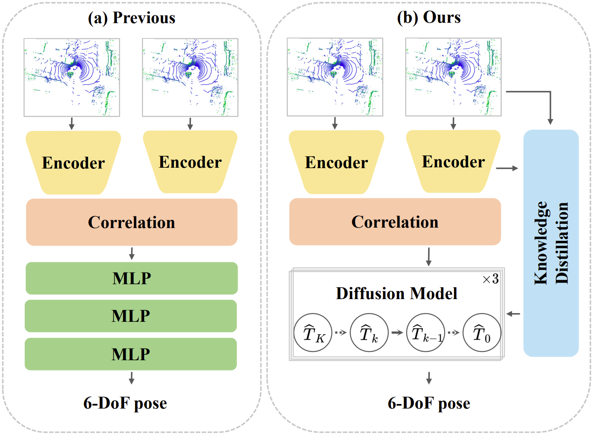
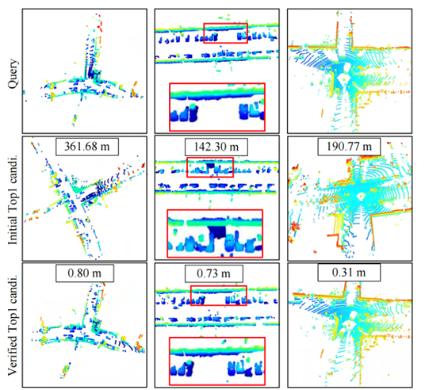
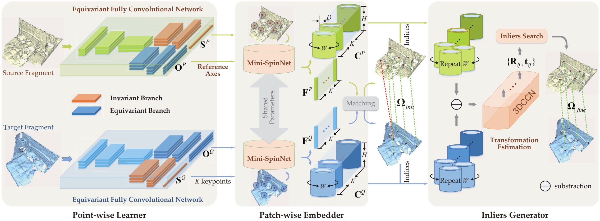
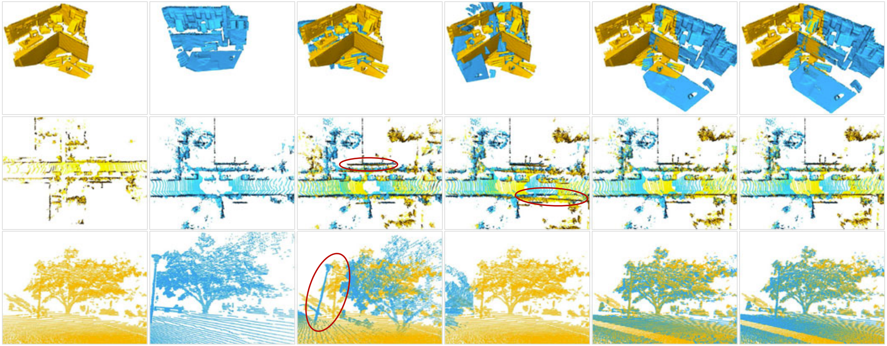
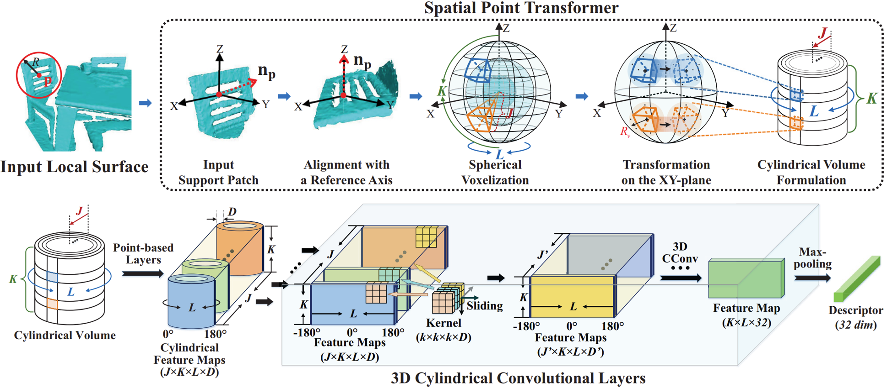

I am an Assistant Professor working with Prof. [Cheng Wang](https://scholar.google.com.hk/citations?user=kAnv3SkAAAAJ&hl=zh-CN&oi=ao) at School of Informatics, Xiamen University in Xiamen, Fujian, China. I received the Ph.D. degree from Sun Yat-Sen University (SYSU) in 2024, supervised by Prof. [Yulan Guo](https://scholar.google.com.hk/citations?user=WQRNvdsAAAAJ&hl=zh-CN&oi=ao). My research interests focus on 3D deep learning, particularly on 3D feature learning, registration and localization.

👨‍🎓**I am actively recruiting self-motivated master students.** 

<li> I plan to admit 2 master students in 2026. I am not concerned about the level of your undergraduate institution; I require a down-to-earth attitude, the drive to improve, a strong sense of self-motivation, and compliance with the laboratory’s unified management.

<li> For master students who aspire to work in the industry, I will focus on cultivating their practical skills. 

<li> For master students who wish to further their academic studies, I will train them to the standard of PhD students, equipping them with the ability to conduct independent research.  

<li> I am also recruiting several high-year undergraduate interns. The recruitment is aimed at students majoring in computer science, automation, mathematics, and related fields.
_______________________________________________________________________________________________________

<html lang="en">
<head>
<meta charset="UTF-8">
<meta name="viewport" content="width=device-width, initial-scale=1.0">
<title>News滚动展示</title>

</head>
<body>
<h3>
   🎉News
</h3>

  

    <ul>
  <li> <strong>[Feb 2025]</strong> Three paper are accepted by <strong>CVPR 2025!</strong></li>
  <li> <strong>[Jun 2025]</strong> One paper is accepted by <strong>ICRA 2025!</strong></li>
    </ul>
  

</body>
</html>

_______________________________________________________________________________________________________

<h3>
   📗 Selected Publications (1️⃣ Equal contribution, 📧 Corresponding author)
</h3>

        <table cellspacing="0" cellpadding="0" class="noBorder">
           <tbody>
               <tr>
                    <td width="40%">
                        
                            </td>
                    <td>
                            <b>Progressive Correspondence Regenerator for Robust 3D Registration</b>
                     
                    Guiyu Zhao1️⃣, <strong>Sheng Ao1️⃣</strong>, Ye Zhang, Kai Xu, Yulan Guo📧. 
                     
                    <em>IEEE/CVF Conference on Computer Vision and Pattern Recognition (<strong>CVPR</strong>, 2025)</em>
                     
                   [<a href="https://github.com/aosheng1996">Paper</a>][<a href="https://github.com/aosheng1996">Project Page</a>]
                    </td>
               </tr>
               <tr>
                    <td width="40%">
                        
                            </td>
                    <td>
                            <b>DiffLO: Semantic-Aware LiDAR Odometry with Diffusion-Based Refinement</b>
                     
                    Yongshu Huang, Chen Liu, Minghang Zhu, <strong>Sheng Ao📧</strong>, Chenglu Wen, Cheng Wang📧. 
                     
                    <em>IEEE/CVF Conference on Computer Vision and Pattern Recognition (<strong>CVPR</strong>, 2025)</em>
                     
                   [<a href="https://github.com/aosheng1996">Paper</a>][<a href="https://github.com/aosheng1996">Project Page</a>]
                    </td>
               </tr>
               <tr>
                    <td width="40%">
                        
                            </td>
                    <td>
                            <b>U^2Frame: A Unified and Unsupervised Learning Framework for LiDAR-based Loop Closing</b>
                     
                    Yixin Zhang1️⃣, <strong>Sheng Ao1️⃣</strong>, Ye Zhang, Zhuo Song, Qingyong Hu, Tao Chang, Yulan Guo. 
                     
                    <em>IEEE International Conference on Robotics and Automation (<strong>ICRA</strong>, 2025)</em>
                     
                   [<a href="https://github.com/aosheng1996">Paper</a>][<a href="https://github.com/aosheng1996">Project Page</a>]
                    </td>
               </tr>
               <tr>
                    <td width="40%">
                        
                            </td>
                    <td>
                            <b>BUFFER: Balancing Accuracy, Efficiency, and Generalizability in Point Cloud Registration</b>
                     
                    <strong>Sheng Ao</strong>, Qingyong Hu, Hanyun Wang, Kai Xu, Yulan Guo. 
                     
                    <em>IEEE/CVF Conference on Computer Vision and Pattern Recognition (<strong>CVPR</strong>, 2023)</em>
                     
                   [<a href="https://github.com/aosheng1996">Paper</a>][<a href="https://github.com/aosheng1996">Project Page</a>]
                    </td>
               </tr>
               <tr>
                    <td width="40%">
                        
                            </td>
                    <td>
                            <b>You Only Train Once: Learning General and Distinctive 3D Local Descriptors</b>
                     
                    <strong>Sheng Ao</strong>, Yulan Guo, Qingyong Hu, Bo Yang, Andrew Markham, Zengping Chen. 
                     
                    <em>IEEE Transactions on Pattern Analysis and Machine Intelligence (<strong>TPAMI</strong>, 2022)</em>
                     
                   [<a href="https://github.com/aosheng1996">Paper</a>][<a href="https://github.com/aosheng1996">Project Page</a>]
                    </td>
               </tr>
               <tr>
                    <td width="40%">
                        
                            </td>
                    <td>
                            <b>SpinNet: Learning a General Surface Descriptor for 3D Point Cloud Registration</b>
                     
                    <strong>Sheng Ao</strong>, Qingyong Hu, Bo Yang, Andrew Markham, Yulan Guo. 
                     
                    <em>IEEE/CVF Conference on Computer Vision and Pattern Recognition (<strong>CVPR</strong>, 2021)</em>
                     
                   [<a href="https://github.com/aosheng1996">Paper</a>][<a href="https://github.com/aosheng1996">Project Page</a>]
                    </td>
               </tr>
           </tbody>
           </table>

<strong>Please visit [my google scholar profile](https://scholar.google.com.hk/citations?user=cvS1yuMAAAAJ&hl=zh-CN&oi=sra) for the full publication list.
_______________________________________________________________________________________________________

<h3>
   Academic Services
</h3>

  <ul>
  <li> <strong>Conference Reviewer</strong>: CVPR, ICCV, ECCV, ICLR </li>
  <li> <strong>Journal Reviewer</strong>: IEEE TPAMI, IJCV, IEEE TIP, IEEE TVCG, IEEE TGRS</li>
  </ul>

 
_______________________________________________________________________________________________________

<h3>
   ✨Hobby
</h3>

  ⚽ 🏸 🏊‍♂️

_______________________________________________________________________________________________________

